# 🏗️ JokeMaster Cloud DevOps Architecture Diagrams

## High-Level Architecture Overview

## Detailed Technical Architecture

## Data Flow Diagram

## CI/CD Pipeline Flow

```mermaid
flowchart TD
    A[👨‍💻 Developer Push to main] --> B[🔄 GitHub Actions Triggered]
    B --> C[📥 Checkout Repository]
    C --> D[🔐 Configure AWS Credentials]
    D --> E[🪣 Ensure S3 State Bucket Exists]
    E --> F[🔒 Ensure DynamoDB Lock Table Exists]
    F --> G[📋 Install Terraform 1.7.5]
    G --> H[🚀 Terraform Init with S3 Backend]
    H --> I[📥 Auto-import Existing Resources]
    I --> J[🏗️ Terraform Apply Infrastructure]
    J --> K[🐳 Login to Amazon ECR]
    K --> L[🔨 Build Docker Image]
    L --> M[📤 Push Image to ECR]
    M --> N[🚀 Update ECS Service]
    N --> O[✅ Deployment Complete]
    
    subgraph "Infrastructure Changes"
        J1[VPC & Networking]
        J2[ECS Cluster & Service]
        J3[Load Balancer & Target Groups]
        J4[Security Groups & IAM]
        J5[Auto-scaling Configuration]
        J6[CloudWatch Logging]
    end
    
    subgraph "Application Changes"
        L1[Node.js Application]
        L2[SQLite Database Schema]
        L3[Frontend Assets]
        L4[Docker Configuration]
    end
    
    J --> J1
    J --> J2
    J --> J3
    J --> J4
    J --> J5
    J --> J6
    
    L --> L1
    L --> L2
    L --> L3
    L --> L4
```

## Security Architecture

```mermaid
graph TB
    subgraph "Security Layers"
        subgraph "Network Security"
            IGW_SEC[🌐 Internet Gateway<br/>Public Internet Access]
            NAT_SEC[🚪 NAT Gateway<br/>Private Outbound Access]
            SG_ALB[🛡️ ALB Security Group<br/>Ports 80,443 from 0.0.0.0/0]
            SG_ECS[🛡️ ECS Security Group<br/>Port 5000 from ALB SG only]
        end
        
        subgraph "Identity & Access Management"
            ECS_ROLE_SEC[👤 ECS Task Execution Role<br/>AssumeRole: ecs-tasks.amazonaws.com]
            LOGGING_POLICY_SEC[📜 ECS Logging Policy<br/>CloudWatch Logs Permissions]
            AWS_POLICIES[🔑 AWS Managed Policies<br/>AmazonECSTaskExecutionRolePolicy]
        end
        
        subgraph "Data Security"
            ECR_SCAN[🔍 ECR Image Scanning<br/>Vulnerability Detection]
            S3_VERSION[📦 S3 Versioning<br/>State File Protection]
            DDB_ENCRYPT[🔐 DynamoDB Encryption<br/>State Lock Protection]
        end
        
        subgraph "Application Security"
            NON_ROOT[👤 Non-root Container User<br/>Security Best Practice]
            HEALTH_CHECK[❤️ Health Checks<br/>ALB & ECS Monitoring]
            LOGGING[📊 Comprehensive Logging<br/>CloudWatch Integration]
        end
    end
    
    subgraph "Security Flow"
        USER_SEC[👤 User] -->|HTTPS/HTTP| IGW_SEC
        IGW_SEC -->|Filtered Traffic| SG_ALB
        SG_ALB -->|Port 80/443 Only| ALB_SEC[⚖️ ALB]
        ALB_SEC -->|Port 5000 Only| SG_ECS
        SG_ECS -->|Restricted Access| ECS_SEC[🐳 ECS Tasks]
        
        ECS_SEC -->|Assume Role| ECS_ROLE_SEC
        ECS_ROLE_SEC -->|Attached Policies| LOGGING_POLICY_SEC
        ECS_ROLE_SEC -->|Attached Policies| AWS_POLICIES
        
        ECS_SEC -->|Outbound via NAT| NAT_SEC
        NAT_SEC -->|Secure Outbound| IGW_SEC
    end
    
    classDef security fill:#ff6b6b,stroke:#fff,stroke-width:2px,color:#fff
    classDef network fill:#4ecdc4,stroke:#fff,stroke-width:2px,color:#fff
    classDef data fill:#45b7d1,stroke:#fff,stroke-width:2px,color:#fff
    classDef app fill:#96ceb4,stroke:#fff,stroke-width:2px,color:#fff
    
    class SG_ALB,SG_ECS,ECS_ROLE_SEC,LOGGING_POLICY_SEC,AWS_POLICIES security
    class IGW_SEC,NAT_SEC,ALB_SEC,ECS_SEC network
    class ECR_SCAN,S3_VERSION,DDB_ENCRYPT data
    class NON_ROOT,HEALTH_CHECK,LOGGING app
```

## Deployment Architecture

```mermaid
graph TB
    subgraph "Development Environment"
        DEV_CODE[💻 Local Development<br/>Node.js + SQLite]
        DEV_DOCKER[🐳 Local Docker<br/>Testing & Validation]
    end
    
    subgraph "Source Control"
        GIT_REPO[📁 GitHub Repository<br/>main branch]
        GIT_WORKFLOW[🔄 GitHub Actions<br/>CI/CD Pipeline]
    end
    
    subgraph "AWS Production Environment"
        subgraph "Infrastructure Layer"
            TERRAFORM[🏗️ Terraform<br/>Infrastructure as Code]
            S3_STATE_PROD[🪣 S3 State Bucket<br/>Production State]
            DDB_LOCK_PROD[🔒 DynamoDB Lock<br/>State Protection]
        end
        
        subgraph "Container Layer"
            ECR_PROD[📦 ECR Repository<br/>Production Images]
            ECS_PROD[🐳 ECS Fargate<br/>Production Tasks]
        end
        
        subgraph "Application Layer"
            ALB_PROD[⚖️ Application Load Balancer<br/>Production Traffic]
            APP_PROD[🟢 JokeMaster App<br/>Production Instance]
        end
        
        subgraph "Monitoring Layer"
            CW_PROD[📊 CloudWatch<br/>Production Monitoring]
            AS_PROD[📈 Auto Scaling<br/>Production Scaling]
        end
    end
    
    subgraph "User Access"
        USERS[👥 End Users<br/>Internet Access]
    end
    
    %% Development Flow
    DEV_CODE -->|Test Locally| DEV_DOCKER
    DEV_CODE -->|Commit & Push| GIT_REPO
    
    %% CI/CD Flow
    GIT_REPO -->|Trigger on Push| GIT_WORKFLOW
    GIT_WORKFLOW -->|Deploy Infrastructure| TERRAFORM
    GIT_WORKFLOW -->|Build & Push Image| ECR_PROD
    GIT_WORKFLOW -->|Update Service| ECS_PROD
    
    %% Infrastructure Management
    TERRAFORM -->|Store State| S3_STATE_PROD
    TERRAFORM -->|Lock State| DDB_LOCK_PROD
    TERRAFORM -->|Provision| ECS_PROD
    TERRAFORM -->|Provision| ALB_PROD
    
    %% Application Deployment
    ECR_PROD -->|Pull Image| ECS_PROD
    ECS_PROD -->|Run Application| APP_PROD
    ALB_PROD -->|Route Traffic| APP_PROD
    
    %% Monitoring & Scaling
    APP_PROD -->|Send Logs| CW_PROD
    CW_PROD -->|Monitor Metrics| AS_PROD
    AS_PROD -->|Scale Tasks| ECS_PROD
    
    %% User Access
    USERS -->|HTTP/HTTPS| ALB_PROD
    
    classDef dev fill:#e1f5fe,stroke:#01579b,stroke-width:2px
    classDef prod fill:#f3e5f5,stroke:#4a148c,stroke-width:2px
    classDef infra fill:#fff3e0,stroke:#e65100,stroke-width:2px
    classDef user fill:#e8f5e8,stroke:#1b5e20,stroke-width:2px
    
    class DEV_CODE,DEV_DOCKER dev
    class ECR_PROD,ECS_PROD,ALB_PROD,APP_PROD,CW_PROD,AS_PROD prod
    class TERRAFORM,S3_STATE_PROD,DDB_LOCK_PROD infra
    class USERS user
```

## Key Architecture Features

### 🔒 **Security Features**
- **Network Isolation**: Private subnets for application tasks
- **Security Groups**: Restrictive inbound/outbound rules
- **IAM Roles**: Least-privilege access for ECS tasks
- **Image Scanning**: ECR vulnerability scanning
- **Non-root Containers**: Security best practices

### 📈 **Scalability Features**
- **Auto-scaling**: CPU-based scaling (1-5 instances)
- **Load Balancing**: Multi-AZ ALB distribution
- **Fargate**: Serverless container execution
- **Health Checks**: Automatic unhealthy task replacement

### 🔄 **CI/CD Features**
- **Infrastructure as Code**: Complete Terraform automation
- **State Management**: S3 backend with DynamoDB locking
- **Auto-import**: Handles existing resources gracefully
- **Zero-downtime**: Rolling deployments via ECS

### 📊 **Monitoring Features**
- **CloudWatch Logs**: Centralized application logging
- **Health Monitoring**: ALB and ECS health checks
- **Metrics**: CPU utilization for auto-scaling
- **Retention**: 7-day log retention policy

### 🌐 **Networking Features**
- **Multi-AZ**: High availability across availability zones
- **Public/Private**: Secure network segmentation
- **NAT Gateway**: Secure outbound internet access
- **Route Tables**: Proper traffic routing

This architecture provides a production-ready, scalable, and secure deployment of the JokeMaster application with comprehensive CI/CD automation.

